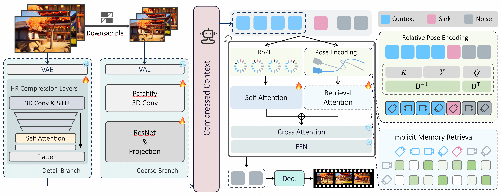

<div align="center">

# CaR: Compression and Retrieval — Implicit Memory Retrieval for Video World Models

<p>
Zhan Peng &nbsp;·&nbsp; et al.<br>
<sub>Huazhong University of Science and Technology &nbsp;·&nbsp; HUJING Digital Media &nbsp;·&nbsp; Sun Yat-sen University</sub>
</p>

[](https://arxiv.org/abs/2606.23105)
[](https://orange-3dv-team.github.io/CaR/)
[](https://orange-3dv-team.github.io/CaR/)
[](https://huggingface.co/Wan-AI/Wan2.2-TI2V-5B)

</div>

---

<table>
<tr>
<td align="center"><b>I2V — Camera</b></td>
<td align="center"><b>V2V — History Extension</b></td>
</tr>
<tr>
<td align="center"><video src="assets/demo/scene_exploration_camera.mp4" controls muted loop width="420"></video></td>
<td align="center"><video src="assets/demo/history_extension.mp4" controls muted loop width="420"></video></td>
</tr>
<tr>
<td align="center"><b>I2V — Action</b></td>
<td align="center"><b>Hard-cut</b></td>
</tr>
<tr>
<td align="center"><video src="assets/open/i2v/sample_010/final_video_indicator.mp4" controls muted loop width="420"></video></td>
<td align="center"><video src="assets/demo/camera_motion_demo_opendomain_27.mp4" controls muted loop width="420"></video></td>
</tr>
</table>

<p align="center">🎬 More examples on the <a href="https://orange-3dv-team.github.io/CaR/">project page</a>.</p>

---

## Overview

**CaR** is a memory mechanism for video world models that maintains long-term
consistency during complex camera movements.

<div align="center">



</div> It compresses past footage into
compact tokens via a **dual-branch compression network**, and uses
**Retrieval Attention** — driven by relative camera poses — to recall the right
context for the target viewpoint. Training and evaluation use **SceneFly**, a
synthetic Unreal Engine 5 dataset (~1,000 minutes across 100 environments with
precise camera parameters).

This repository provides open-source **inference** for CaR on top of
**Wan2.2-TI2V-5B**, unifying four generation modes behind a single script.

| Mode | Input | Description |
|------|-------|-------------|
| `camera`   | image + camera trajectory (`traj.json`) | I2V following an explicit camera pose trajectory |
| `action`   | image + action commands (`--motion_sequence`) | I2V driven by WASD-style commands, generated autoregressively |
| `hardcut`  | image + action commands with `skip:` prefixes | Multi-shot generation with hard cuts (`skip:` advances the camera without rendering) |
| `continue` | video + `context_poses.json` + action commands | V2V continuation: extend an existing video with controlled segments |

`action`, `hardcut`, and `continue` share the same action syntax (composite
commands joined with `+`, e.g. `"w+right"`) and additionally produce a
`final_ui.mp4` with a keyboard + mouse-sphere overlay so you can see which
command produced which clip. The script auto-detects whether the input is an
image, a video, or a folder of images.

---

## Installation

### Requirements

- Python 3.10
- PyTorch 2.7.1
- CUDA 12.8

Other CUDA-enabled PyTorch builds may work if they are compatible with your driver and GPU.

### Steps

```bash
# 1. Create the environment
conda create -n car python=3.10
conda activate car

# 2. Clone the repository
git clone https://github.com/Orange-3DV-Team/CaR.git
cd CaR

# 3. Install PyTorch matching your CUDA (example: CUDA 12.8)
pip install torch torchvision torchaudio --index-url https://download.pytorch.org/whl/cu128

# 4. Install the remaining dependencies
pip install -r requirements.txt
```

### Checkpoints

Prepare the following, then reference their paths when running:

- **Base model** — [Wan2.2-TI2V-5B](https://huggingface.co/Wan-AI/Wan2.2-TI2V-5B):

  ```bash
  huggingface-cli download Wan-AI/Wan2.2-TI2V-5B --local-dir /path/to/Wan2.2-TI2V-5B
  ```

- **CaR checkpoint** — the trained memory-encoder + camera-control weights on top
  of the base model. It can be a directory containing `model.safetensors`, or a
  single `.safetensors` / `.pt` / `.pth` / `.bin` file supported by `core/utils.py`.

In the commands below, `wan22_ckpt` points to the Wan2.2-TI2V-5B directory and
`car_checkpoint` points to the CaR checkpoint.

---

## Demo

`demo.sh` runs every `sample_*` folder for a given mode. Pass the two checkpoint
paths after the mode; results are written under `output/<mode>_demo/`.

```bash
bash demo.sh camera   /path/to/Wan2.2-TI2V-5B /path/to/car_checkpoint  # explicit camera pose trajectory
bash demo.sh action   /path/to/Wan2.2-TI2V-5B /path/to/car_checkpoint  # WASD-style action commands
bash demo.sh hardcut  /path/to/Wan2.2-TI2V-5B /path/to/car_checkpoint  # multi-shot with skip: hard cuts
bash demo.sh continue /path/to/Wan2.2-TI2V-5B /path/to/car_checkpoint  # V2V continuation from a context video
```

The default motion sequences and inputs for each mode live at the top of
`demo.sh` and can be edited there.

---

## Inference on a Single Input

Use `infer.sh` to generate one video from a single image and prompt. Pass the two
checkpoint paths as arguments, and edit `image` / `prompt` / `motion` / `traj` at
the top of `infer.sh` to change the inputs.

```bash
bash infer.sh /path/to/Wan2.2-TI2V-5B /path/to/car_checkpoint
```

The editable inputs at the top of `infer.sh`:

```bash
image="examples/i2v/images/sample_001"      # image file or folder of images
prompt=""                                    # text prompt; empty -> use prompt.txt next to input
motion="w+up,down,skip:right,a,skip:left,w"  # action commands; "skip:" inserts a hard cut
traj=""                                       # camera trajectory json; leave empty to use motion
```

**How the mode is selected:**

- **Motion-driven (default):** the video follows the `motion` sequence. If `motion`
  contains any `skip:` command, hardcut mode is used; otherwise action mode is used.
- **Camera trajectory:** set `traj` to a camera pose file (format like
  [`examples/i2v/camera/traj.json`](examples/i2v/camera/traj.json)). When `traj` is
  set, the camera trajectory is followed automatically and `motion` is ignored.

Output is saved under `output_dir` (default `output/infer/`).

### Running `inference.py` directly

`infer.sh` is a thin wrapper around `inference.py`; call it directly for full control.

<details>
<summary><b>Camera mode</b></summary>

```bash
python inference.py \
  --mode camera \
  --checkpoint_dir /path/to/Wan2.2-TI2V-5B \
  --car_checkpoint /path/to/car_checkpoint \
  --input_path examples/i2v/images/sample_001 \
  --target_poses examples/i2v/camera/traj.json \
  --output_dir output/camera_demo/sample_001_traj \
  --height 480 --width 832 --frame_num 81 \
  --sampling_steps 50 --guide_scale 3.0 \
  --seed 0
```
</details>

<details>
<summary><b>Action mode</b></summary>

```bash
python inference.py \
  --mode action \
  --checkpoint_dir /path/to/Wan2.2-TI2V-5B \
  --car_checkpoint /path/to/car_checkpoint \
  --input_path examples/i2v/images/sample_001 \
  --motion_sequence "right,right,right,left,left,left" \
  --step_size 4.0 \
  --rotate_angle 30.0 \
  --pitch_angle 15.0 \
  --output_dir output/action_demo/sample_001 \
  --height 480 --width 832 --frame_num 81 \
  --sampling_steps 50 --guide_scale 3.0 \
  --seed 0
```
</details>

<details>
<summary><b>Hardcut mode</b></summary>

```bash
python inference.py \
  --mode hardcut \
  --checkpoint_dir /path/to/Wan2.2-TI2V-5B \
  --car_checkpoint /path/to/car_checkpoint \
  --input_path examples/i2v/images/sample_001 \
  --motion_sequence "w+up,down,skip:right,a,skip:left,w" \
  --step_size 4.0 \
  --rotate_angle 30.0 \
  --pitch_angle 15.0 \
  --output_dir output/hardcut_demo/sample_001 \
  --height 480 --width 832 --frame_num 81 \
  --sampling_steps 50 --guide_scale 3.0 \
  --seed 0
```
</details>

<details>
<summary><b>Continue mode</b></summary>

```bash
python inference.py \
  --mode continue \
  --checkpoint_dir /path/to/Wan2.2-TI2V-5B \
  --car_checkpoint /path/to/car_checkpoint \
  --input_path examples/continue/sample_001/context_video.mp4 \
  --context_poses examples/continue/sample_001/context_poses.json \
  --motion_sequence "d,left" \
  --step_size 4.0 \
  --rotate_angle 30.0 \
  --pitch_angle 15.0 \
  --output_dir output/continue_demo/sample_001 \
  --height 480 --width 832 --frame_num 81 \
  --sampling_steps 50 --guide_scale 3.0 \
  --seed 0
```
</details>

---

## Inputs


- **Action commands** (`--motion_sequence`): comma-separated commands from
  `w, s, a, d, left, right, up, down`. Composite commands joined by `+` (e.g.
  `"w+right"`) apply both at once. Prefix with `skip:` (hardcut mode) to
  advance the camera without rendering that segment.


---

## Notes

- **Coordinate system:** CV convention (x = right, y = down, z = forward).
- **Default resolution:** 480×832, 81 frames (`4n+1`, friendly to the VAE temporal stride of 4).
- Camera condition method `relray_absmap` and RoPE mode `rope+memrope` follow the trained checkpoint.
- Memory and HR-frame conditioning are enabled by default; toggle with `--no_memory` / `--no_hr_frame`.
- Segment files are named `segment_<idx>_<label>.mp4` for action/hardcut/continue
  (label = the command that produced them) and `segment_<idx>.mp4` for camera mode.

---

## Citation

If you find CaR useful, please consider citing:

```bibtex
@article{peng2026car,
  title   = {Compression and Retrieval: Implicit Memory Retrieval for Video World Models},
  author  = {Peng, Zhan and others},
  journal = {arXiv preprint arXiv:2606.23105},
  year    = {2026}
}
```
