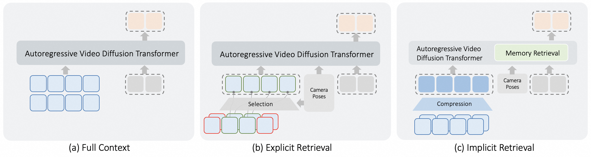

# CaR: Compression and Retrieval

### Implicit Memory Retrieval for Video World Models

**Zhan Peng<sup>1</sup>, Jie Ma<sup>2</sup>, Huiqiang Sun<sup>1</sup>, Chong Gao<sup>3</sup>, Zhijie Xue<sup>1</sup>, Zhiyu Pan<sup>1</sup>, Zhiguo Cao<sup>1\*</sup>, Jun Liang<sup>2</sup>, Jing Li<sup>2</sup>**

<sup>1</sup>Huazhong University of Science and Technology &nbsp; <sup>2</sup>HUJING Digital Media & Entertainment Group &nbsp; <sup>3</sup>Sun Yat-sen University &nbsp; <sup>\*</sup>Corresponding author

[](https://arxiv.org/abs/XXXX.XXXXX)
[](https://github.com/Orange-3DV-Team/CaR)

---

<table>
<tr>
<td align="center"><b>I2V — Camera</b></td>
<td align="center"><b>V2V — History Extension</b></td>
</tr>
<tr>
<td><video src="assets/videos/i2v_camera.mp4" width="100%" autoplay loop muted playsinline></video></td>
<td><video src="assets/videos/v2v_extension.mp4" width="100%" autoplay loop muted playsinline></video></td>
</tr>
<tr>
<td align="center"><b>I2V — Action</b></td>
<td align="center"><b>Hard-cut</b></td>
</tr>
<tr>
<td><video src="assets/videos/i2v_action.mp4" width="100%" autoplay loop muted playsinline></video></td>
<td><video src="assets/videos/hard_cut.mp4" width="100%" autoplay loop muted playsinline></video></td>
</tr>
</table>

---

## Abstract

Video world models hold promise for simulating interactive environments, yet maintaining consistent long-term memory across complex camera trajectories remains a critical challenge. Existing methods typically rely on computationally expensive context scaling or rigid heuristic retrieval mechanisms, which lacks generalization to varying camera trajectories and environments. In this paper, we propose **CaR** (**C**ompression **a**nd **R**etrieval), an attention-driven implicit memory retrieval mechanism to overcome these limitations. By injecting viewpoint information via positional encoding, our method performs flexible memory retrieval through attention computation. To efficiently process extended contexts with minimal computational overhead, we further introduce a lightweight context compression network. Furthermore, we construct **SceneFly**, a large-scale synthetic dataset featuring realistic camera trajectories and frame-level annotations to train and evaluate long-horizon video world models. Extensive experiments demonstrate that our approach achieves state-of-the-art results on established benchmarks and exhibits strong generalization to open-domain scenes.

---

## Method



**Comparison of Memory Paradigms.** (1) Scaling up the context window is computationally prohibitive. (2) Explicit retrieval relies on hand-crafted heuristic rules, severely restricting generalization. (3) Our implicit retrieval is attention-driven, performing retrieval directly within the global context.


A dual-branch compression network converts the historical video into compact context tokens. The context, an uncompressed sink frame, and noisy target tokens are then processed by two parallel attention branches: standard self-attention preserves the pretrained video prior, while **Retrieval Attention** uses relative camera poses to retrieve relevant history and control the target viewpoint.

---

## Key Contributions

**1. Implicit Memory Retrieval via Retrieval Attention**

A zero-initialized Retrieval Attention branch runs in parallel with standard self-attention. Relative Pose Encoding injects relative camera viewpoints into attention, so the model automatically suppresses irrelevant history and amplifies geometrically similar viewpoints — enabling implicit retrieval without explicit frame selection.

**2. Context Compression**

A dual-branch encoder (coarse path + detail path) dramatically reduces context token count, making global attention over the full history computationally affordable without discarding retrieval-relevant evidence.

**3. Flexible Viewpoint Switching & Camera Hard Cut**

Supports fully discontinuous camera trajectory transitions (hard cuts), where the target viewpoint is arbitrarily distant from the input context. The model synthesizes scene-consistent videos by retrieving purely from long-term memory.

---

## SceneFly Dataset

**SceneFly** is a large-scale synthetic dataset built with Unreal Engine 5, containing approximately 1,000 minutes of video from 100 diverse indoor, outdoor, and stylized scenes, with exact frame-level camera intrinsics and extrinsics. It is specifically designed for training and evaluating long-horizon video world models with complex revisiting trajectories.

---

## Demo

Visit the **[project page](https://github.com/Orange-3DV-Team/CaR)** for video demonstrations of:

- **Single Image Scene Exploration** — camera-controlled and action-controlled novel view synthesis from a single input image
- **History Video Extension** — scene-consistent video-to-video generation
- **Flexible Viewpoint Switching** — hard-cut generation with fully discontinuous camera trajectories

---

## Code

Code will be released soon. Stay tuned!

---

## Citation

```bibtex
@article{peng2026car,
    title={Compression and Retrieval: Implicit Memory Retrieval for Video World Models},
    author={Peng, Zhan and Ma, Jie and Sun, Huiqiang and Gao, Chong and
            Xue, Zhijie and Pan, Zhiyu and Cao, Zhiguo and
            Liang, Jun and Li, Jing},
    journal={arXiv},
    year={2026}
}
```
